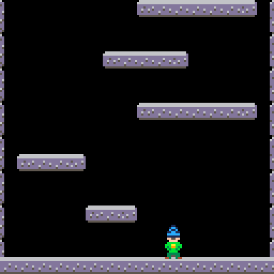

<div align="center">
  <br>
  <h1>Icy 8</h1>
  <p>
    <b>A <a href="https://www.lexaloffle.com/pico-8.php">PICO-8</a> demake of <a href="https://en.wikipedia.org/wiki/Icy_Tower">Icy Tower</a>.</b><br />
  <sup>(Original by <a href="https://johanpeitz.com/">Johan Peitz</a>)</sup>
  </p>
  <br>
  <br>
  
</div>

## Files

```
.
├── README.md     This file
├── main.p8       The main cart entry point
├── main.lua      The code for your game, included by main.p8
├── debugger.lua  Useful debugging methods
└── *.sh          Various scripts (see below)
```

## Scripts

### `start.sh`

Run your game in the PICO-8 console

### `watch.sh`

Watch for changes in any `.p8` or `.lua` file and automatically build a HTML/JS
export (saved to `export/`).

### `serve.sh`

Serve a HTML/JS export (from `export/`), and automatically reload the browser
when that export changes.

Works great with `watch.sh`.
